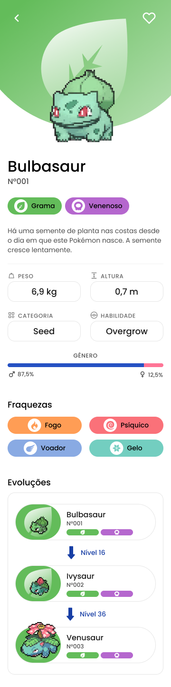
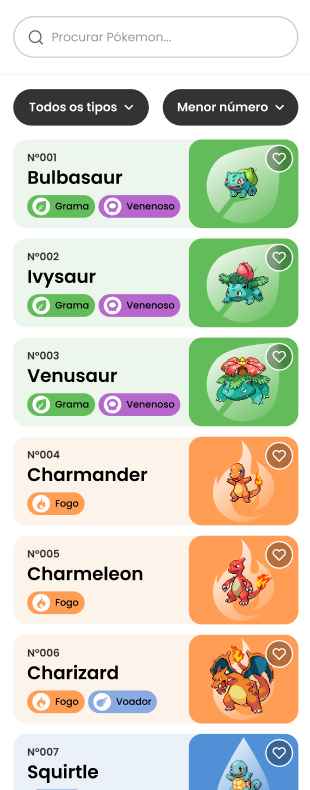

# Pokédex

Este projeto é uma Pokédex interativa, permitindo que os usuários explorem e visualizem detalhes sobre diferentes espécies de Pokémon. O design está disponível no Figma, e o desenvolvimento está em andamento para oferecer uma experiência amigável e intuitiva aos amantes de Pokémon.

## Status do Projeto

### 🚧 **Em construção** 🚧

---

## Sumário

1. [Design do Projeto](#design-do-projeto)
2. [Requisitos](#requisitos)
3. [Arquitetura](#arquitetura)
4. [Tecnologias Utilizadas](#tecnologias-utilizadas)
5. [Design e Interface do Usuário](#design-e-interface-do-usuário)
6. [Camada de Dados](#camada-de-dados)
7. [Considerações de Segurança](#considerações-de-segurança)
8. [Documentação de APIs](#documentação-de-apis)
9. [Escalabilidade e Desempenho](#escalabilidade-e-desempenho)
10. [Fluxo de Integração Contínua (CI/CD)](#fluxo-de-integração-contínua-cicd)
11. [Monitoramento e Logs](#monitoramento-e-logs)
12. [Anexos](#anexos)

---

## 1. Design do Projeto

O design do aplicativo pode ser visualizado diretamente no Figma:
[Link para o design no Figma](https://www.figma.com/community/file/1202971127473077147)

### Telas Principais

#### Tela de detalhes do Pokémon



#### Tela inicial



#### Tela de Onboard


#### Tela de Login


---

## 2. Requisitos

### Requisitos Funcionais

1. **Buscar Pokémons:** Permitir ao usuário buscar informações detalhadas de pokémons utilizando a PokeAPI.
2. **Filtros por Tipo:** Possibilitar que o usuário filtre os pokémons por tipo (água, fogo, planta, etc.).
3. **Detalhamento dos Pokémons:** Exibir informações detalhadas, como nome, habilidades, estatísticas e evolução.
4. **Navegação Intuitiva:** Interface amigável que permita uma navegação fácil entre pokémons e filtros.
5. **Favoritos:** Possibilidade de marcar pokémons favoritos.

### Requisitos Não Funcionais

1. **Escalabilidade:** Suportar um número elevado de usuários simultâneos.
2. **Desempenho:** Carregar rapidamente as informações dos pokémons com uma experiência de navegação fluida.
3. **Segurança dos Dados:** Garantir que os dados dos usuários estejam seguros.
4. **Offline First:** Opção de armazenamento offline para pokémons já visualizados pelo usuário.

---

## 3. Arquitetura

### Arquitetura da Aplicação

O aplicativo segue uma arquitetura modular, dividida em camadas para facilitar manutenção e evolução:

- **Apresentação (Frontend):** Interface do usuário, responsável pela navegação, exibição dos dados e interação com o usuário.
- **Serviços (API):** Conexão com a PokeAPI, onde as informações dos pokémons são buscadas.
- **Persistência de Dados:** Uso de cache para dados acessados recentemente, possibilitando um modo offline para pokémons já visualizados.

### Diagrama de Arquitetura

```plaintext
[ Usuário ]
      |
[ Interface Mobile ]
      |
[ Serviço de Dados - PokeAPI ]
      |
[ Camada de Persistência - Cache Local ]
```

---

## 4. Tecnologias Utilizadas

- **Frontend:** React Native com Expo
- **Backend:** Integração direta com a PokeAPI
- **Persistência Local:** AsyncStorage (para cache)
- **Linguagem:** TypeScript
- **Ferramentas de UI:** React Navigation, Context API para gerenciamento de estado
- **Autenticação:** Clerk (para login e favoritos)
- **Testes:** Jest, Testing Library

---

## 5. Design e Interface do Usuário

O design foi criado para oferecer uma navegação intuitiva:

- **Tela Inicial:** Lista de pokémons com a possibilidade de aplicar filtros de tipos.
- **Detalhes do Pokémon:** Exibe dados como habilidades, estatísticas e evoluções.
- **Favoritos:** Tela para salvar e visualizar pokémons marcados como favoritos.

---

## 6. Camada de Dados

### Fonte de Dados

A aplicação utiliza a **PokeAPI** para buscar dados dos pokémons. O cache local é implementado com **AsyncStorage**, permitindo acesso offline a pokémons previamente visualizados.

### Estrutura de Dados

```typescript
interface Pokemon {
  id: number;
  name: string;
  types: string[];
  abilities: string[];
  stats: {
    hp: number;
    attack: number;
    defense: number;
    speed: number;
  };
  evolution: string[];
}
```

---

## 7. Considerações de Segurança

1. **Autenticação:** Implementação via Clerk para login e favoritos.
2. **Segurança dos Dados:** Dados sensíveis são criptografados. Utilizamos SSL para comunicações seguras com a PokeAPI.
3. **Offline Cache:** Dados são armazenados de forma segura e só incluem informações de pokémons visualizados.

---

## 8. Documentação de APIs

### PokeAPI

**Endpoint:** `https://pokeapi.co/api/v2/`  
**Exemplo de Requisição para Pokémons:** `/pokemon/{id}`  
**Exemplo de Requisição para Tipo:** `/type/{id}`

### Documentação OpenAPI

A documentação completa dos endpoints da PokeAPI pode ser acessada [aqui](https://pokeapi.co/docs/v2).

---

## 9. Escalabilidade e Desempenho

- **Caching Local:** AsyncStorage é usado para dados visualizados recentemente.
- **Pagination:** Listagem de pokémons com paginação para otimizar carregamento.
- **Balanceamento de Carga:** Planejamento para o uso de CDN, otimizando o tempo de resposta.

---

## 10. Fluxo de Integração Contínua (CI/CD)

**Ferramentas:** GitHub Actions e Expo  
**Processo:**

1. **Build Automático:** O app é construído automaticamente para cada PR.
2. **Testes Automatizados:** Testes unitários e de integração executados no CI.
3. **Publicação:** Versão beta disponibilizada no Expo para testes.

---

## 12. Anexos

- **Link do Prototipo:** [Figma](https://www.figma.com/community/file/1202971127473077147)
- **Documentação Completa PokeAPI:** [Documentação PokeAPI](https://pokeapi.co/docs/v2)
